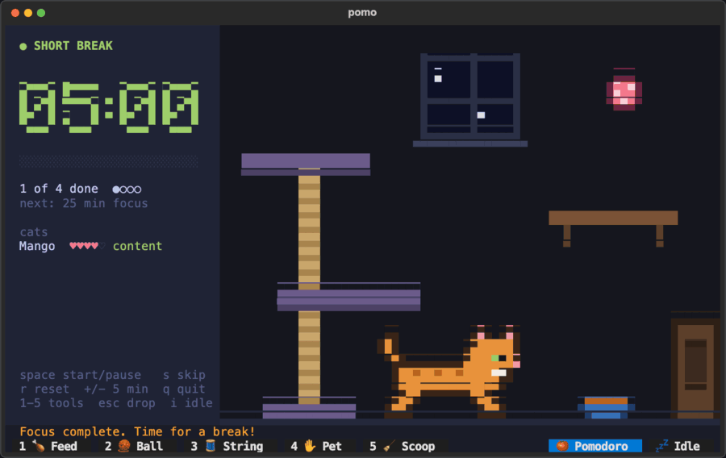
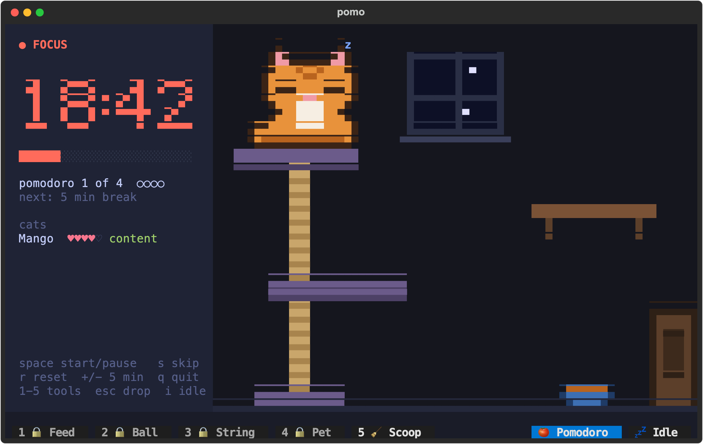
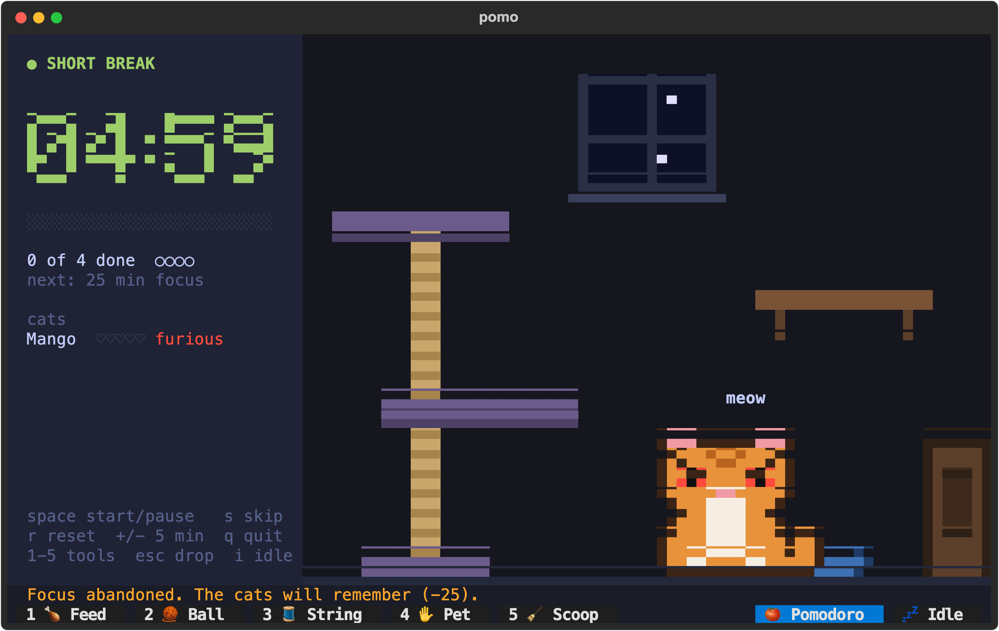
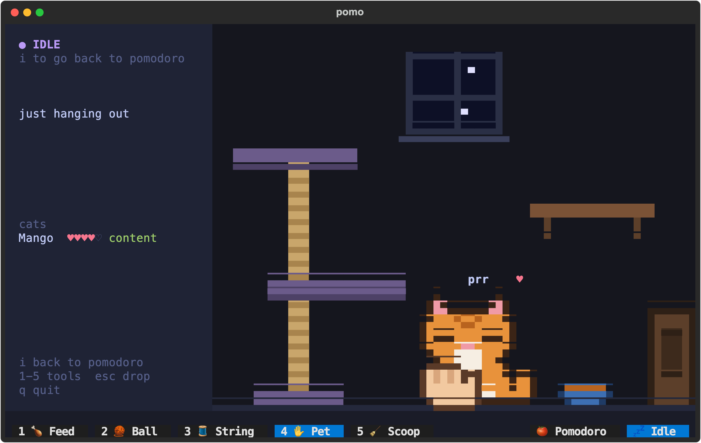
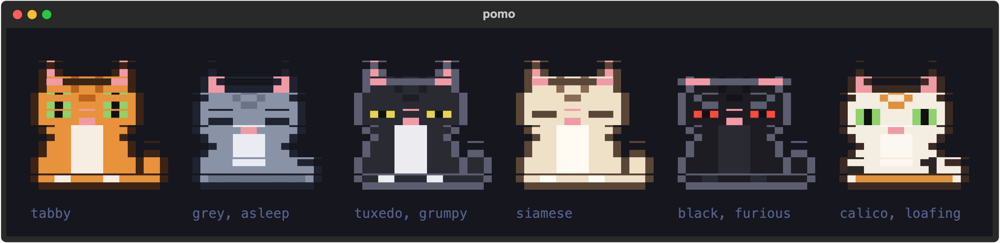

# pomo 🍅

**A pomodoro timer for your terminal, with a room full of pixel-art cats who notice when you skip your breaks.**

[](https://github.com/Kalcode/pomodoro-timer-tui-cats/actions/workflows/tests.yml)
[](LICENSE)

<p align="center">
  
</p>

pomo is a classic pomodoro timer: 25 minutes of focus, a 5 minute break, and a long break after every fourth round. When each one ends it pings your desktop, and your phone through [ntfy](https://ntfy.sh).

It also has Mango, who lives in the room next to the clock. Mango naps up on the cat tree while you focus, gets the zoomies on your breaks, eats, plays, pops out through the litter door, and keeps score. Stick to your pomodoros and Mango stays content. Skip a focus, skip a break or pause for too long, and Mango gets grumpy, then pissy, then furious.

<table>
  <tr>
    <td></td>
    <td></td>
  </tr>
  <tr>
    <td align="center"><b>Focus is nap time.</b> The tools lock and Mango sleeps up high.</td>
    <td align="center"><b>Rules have teeth.</b> pomo asks first, and then Mango remembers.</td>
  </tr>
</table>

## What you get

- **A real pomodoro timer:** a big pixel clock, a progress bar, your place in the set, and `+`/`-` to add or take away 5 minutes. It keeps exact time, keeps your Mac awake while a phase runs, and asks before you break a rule.
- **Pings when each phase ends,** on your desktop and on your phone through ntfy, with a line about how Mango is doing.
- **A cat with an inner life:** mood, hunger, playfulness and affection. Mango walks, climbs, jumps between the cat tree and the shelf, naps, eats from the bowl and begs when it's empty.
- **Ways to look after him:** fill the bowl, roll him a yarn ball, dangle a string, pet him with the mouse.
- **Idle mode:** put the timer away and just hang out with the cat.
- **It remembers you:** quit and come back later, and Mango and your place in the set are still there.

<p align="center">
  
</p>

## Install

You need:
- **Python 3.12 or newer** and [uv](https://docs.astral.sh/uv/).
- **A terminal with 24-bit colour and room for 100×30 cells.** iTerm2 and Ghostty on macOS are what pomo is made for. Other modern terminals should work. Linux is best effort, and tmux isn't supported.

```bash
uv tool install git+https://github.com/Kalcode/pomodoro-timer-tui-cats
```

That puts `pomo` on your PATH, and `uv tool upgrade pomo` updates it later. `pipx install git+https://github.com/Kalcode/pomodoro-timer-tui-cats` works too.

## Use

```bash
pomo                               # 25 min focus, 5 min breaks, 15 min long break every 4
pomo --focus 50 --short-break 10   # your own lengths, in minutes
pomo --idle                        # no timer: just hang out with the cats
pomo --init                        # write a starter config file, with a private ntfy topic
pomo --test-ping                   # check desktop and phone notifications right now
pomo --help                        # every flag, key and config option
```

| Key | What it does |
|---|---|
| `space` | Start or pause |
| `s` | Skip to the next phase |
| `r` | Restart this phase |
| `+` / `-` | Add or take away 5 minutes |
| `i` | Switch between Pomodoro and Idle |
| `1`–`5` | Pick up a care tool (feed, ball, string, pet, scoop) |
| `esc` | Put the tool down |
| `q` | Quit |

## What Mango cares about

Mango starts at mood 80. The roster under the clock shows his hearts (one per 20 mood) and how he feels.

| You… | Mood |
|---|---|
| Finish a focus of 15 minutes or more | +10 |
| Take a break all the way to the end | +5 |
| Abandon a focus: skip it, restart it, quit, or switch to Idle partway through | −25 |
| Skip a break | −20 |
| Pause a focus for more than 3 minutes in total | −10 |

Anything that breaks a rule asks first and tells you what it'll cost. Closing the window mid-focus counts as abandoning it: Mango remembers you left.

Mood sets how he behaves:
- **Content** (70 and up): naps, wanders, plays.
- **Grumpy** (40–69): sulks and sometimes ignores his toys.
- **Pissy** (15–39): red eyes, and he won't play or be petted.
- **Furious** (below 15): the same, for now.

Anger cools slowly on its own, back up to content but no further.

His needs fill up as pomo runs: hunger in 3 hours, play in 2, and affection in under 2 (Mango is clingy, so he wants fuss sooner). A need over 70 shows a bubble and slowly sours his mood, though needs alone never take him below grumpy. Looking after him meets those needs and cheers him up, but only as much as he actually needed it, so you can't pet away a skipped break.

## Looking after Mango

Pick a tool with `1`–`5` or the toolbar under the message line:

- **1 Feed:** click the bowl, or press `1` again, to fill it. Hungry cats come to eat.
- **2 Ball:** click to drop a yarn ball. It bounces and rolls, and a cat who wants to play will chase it and bat it around.
- **3 String:** a string hangs from your mouse. Wiggle it and Mango pounces, even up on the cat tree.
- **4 Pet:** stroke him with the mouse. Content cats purr and float hearts, angry ones hiss, and too much petting earns a swat.
- **5 Scoop:** click a poop to clean it up. Pooping on the floor is coming soon.

A focus is nap time, so only the scoop works until your break. Idle mode (`i`) puts the timer away and unlocks everything.

## Phone pings in 3 steps

1. `pomo --init` writes `~/.config/pomo/config.toml`, readable only by you, with a random private ntfy topic in it.
2. Install the [ntfy](https://ntfy.sh) app on your phone, tap +, and subscribe to the topic from that file.
3. `pomo --test-ping` sends a test notification to your desktop and your phone right now, and says how each went.

Anyone who knows the topic can read your pings, so keep it to yourself. pomo never prints or logs it, and it's deliberately not a command-line flag, so it stays out of your shell history. On macOS, if no desktop banner shows up, allow notifications for Script Editor in System Settings → Notifications.

The config file holds the rest of the settings. Every key is optional:

```toml
ntfy_server = "https://ntfy.sh"   # or your own ntfy server
topic = "pomo-…"                  # empty means no phone pings
focus = 25                        # minutes
short_break = 5
long_break = 15
long_every = 4                    # a long break after this many focus sessions
```

## Good to know

- **pomo remembers where you were.** It saves to `~/.local/state/pomo/save.json` on every phase change, every 30 seconds and when you quit. Nothing happens while it's closed: Mango doesn't get hungry while you're away.
- **Only one pomo runs at a time.** A second one tells you and exits.
- **It keeps your Mac awake, but only while a phase is running.** It does this with `caffeinate`. The screen can still sleep, and closing the lid still sleeps the Mac.
- **In a window smaller than 100×30**, a sad Mango asks for more room and the timer carries on as text.

## The cast

<p align="center">
  
</p>

Every cat is drawn in half-block pixels from text grids, with six coats and five moods. Today it's just Mango. Here's what's coming:
- **Consequences:** angry cats that poop on the floor, knock the bowl over, and climb onto your clock until they calm down.
- **Progression:** treats for every focus, a shop with tuna, toys and furniture, and strays that turn up at the window to be adopted.

`pomo --gallery` shows every pose, face and prop.

## Develop

```bash
git clone https://github.com/Kalcode/pomodoro-timer-tui-cats
cd pomodoro-timer-tui-cats
uv sync
uv run pytest                          # the whole suite, in about 15 seconds
uv run pomo --gallery                  # every sprite, for tuning the art
uv run python scripts/screenshots.py   # redraw the pictures in this README
```

`uv tool install --editable .` puts a `pomo` on your PATH that always runs your working copy.

How it's put together:

| Path | What's there |
|---|---|
| `src/pomo/timer.py`, `session.py` | The timer and its rules, which send events to the rest of the game |
| `src/pomo/game/` | The cats, their moods and needs, how they move, the toys, and the world they live in. Plain Python, no UI. |
| `src/pomo/render/` | The pixel canvas, the sprites, the font and the theme. A pure function draws each frame. |
| `src/pomo/ui/` | The [Textual](https://textual.textualize.io) app: the screen, the toolbar and the dialogs |
| `src/pomo/persist.py`, `notify.py`, `config.py` | Saving, notifications and settings |

The game core never reads the clock or the dice directly: both are passed in. So a test can fast-forward hours of cat life in a fraction of a second.

pomo was designed and built with [Claude Code](https://claude.com/claude-code), one milestone at a time. The specs and plans it was built from are in [docs/design/](docs/design/).

## License

[MIT](LICENSE) © David Clausen
